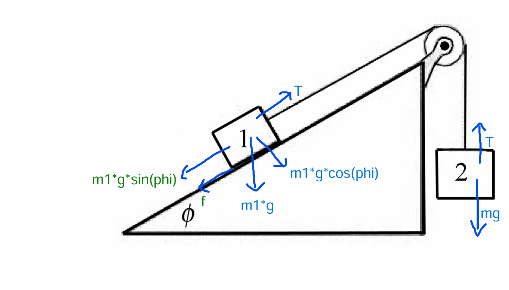
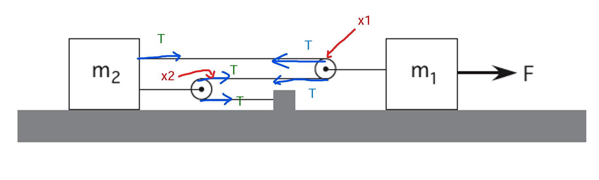

# 10.015 Physical World
Dr. Chen Jer Ming
Dr. Ng Wei Khim  

## Table of contents
- [10.015 Physical World](#10015-physical-world)
  - [Table of contents](#table-of-contents)
  - [Course Overview](#course-overview)
    - [Progressive learning help sessions](#progressive-learning-help-sessions)
  - [Mid Terms](#mid-terms)
  - [1D Project](#1d-project)
  - [2D Project](#2d-project)
  - [Week 1: Vector in Physics and Engineering](#week-1-vector-in-physics-and-engineering)
    - [Vector Algebra](#vector-algebra)
      - [Case Problem 0: Vector Algebra ](#case-problem-0-vector-algebra-)
    - [Polar Coordinate System](#polar-coordinate-system)
    - [Cylindrical Coordinates](#cylindrical-coordinates)
  - [Week 2-1: Kinematics](#week-2-1-kinematics)
  - [Week 2-2: Frame of Reference and Projectile Motion](#week-2-2-frame-of-reference-and-projectile-motion)
  - [Week 3-1: Concept of Forces and Newton's 3 Laws of Motion](#week-3-1-concept-of-forces-and-newtons-3-laws-of-motion)
    - [Newton's Laws](#newtons-laws)
      - [Newton's First Law (Law of Inertia)](#newtons-first-law-law-of-inertia)
      - [Newton's Second Law (Describing a force)](#newtons-second-law-describing-a-force)
      - [Newton's Third Law](#newtons-third-law)
    - [Forces](#forces)
      - [Gravitational Force](#gravitational-force)
      - [Contact Force](#contact-force)
      - [Spring Force](#spring-force)
      - [Tension Force](#tension-force)
    - [Free Body Diagrams](#free-body-diagrams)
    - [Case Problem 1](#case-problem-1)
    - [Case Problem 2](#case-problem-2)
  - [Week 3-2: Friction Forces and Ideal Pulley Systems](#week-3-2-friction-forces-and-ideal-pulley-systems)
    - [Case Problem 1](#case-problem-1-1)
    - [Case Problem 2](#case-problem-2-1)
    - [Case Problem 3](#case-problem-3)
  - [Week 4-1: Circular Motion](#week-4-1-circular-motion)
    - [Case Problem 1](#case-problem-1-2)
    - [Case Problem 2](#case-problem-2-2)
  - [Week 4-2: Dynamics of uniform and non-uniform circular motion](#week-4-2-dynamics-of-uniform-and-non-uniform-circular-motion)
  - [Week 5-1: Rotational Kinematics, Torque and Moment of Inertia of a Point mass](#week-5-1-rotational-kinematics-torque-and-moment-of-inertia-of-a-point-mass)
    - [Case Problem 1](#case-problem-1-3)
  - [Week 5-2: Rigid bodies](#week-5-2-rigid-bodies)
    - [Concept of rigid body](#concept-of-rigid-body)
    - [Parallel axis Theorem](#parallel-axis-theorem)
  - [Week 6-1](#week-6-1)
  - [Week 6-2: Rolling of rigid bodies without Slipping](#week-6-2-rolling-of-rigid-bodies-without-slipping)
    - [Case Problem 4](#case-problem-4)
  - [Week 8-1: Energy](#week-8-1-energy)
    - [Conservation of energy](#conservation-of-energy)
    - [Work Done by Constant Force](#work-done-by-constant-force)
  - [Week 8-2: Momentum](#week-8-2-momentum)
    - [Work done by gravitational force](#work-done-by-gravitational-force)
  - [Week 9-1: Conservation of Momentum](#week-9-1-conservation-of-momentum)
    - [Mean value theorem](#mean-value-theorem)
    - [Impulse](#impulse)
  - [Week 9-2: Collisions](#week-9-2-collisions)
    - [Elastic Collisions](#elastic-collisions)
    - [Inelastic Collisions](#inelastic-collisions)

## Course Overview
### Progressive learning help sessions
Location: CC15 (2.6)

Wednesday: 15:00 - 16:30

Friday: 14:00 - 15:30

Coverage:
- Classical mechanics and thermodynamics
- Describing motion
- Explaining motion
- Thermodynamics

Grading breakdown
- 20% - Mid Terms
- 30% - Finals
- 10% - Homework (5/7 are graded)
- 5% - Class part
- 25% - 1D project
- 10% - 2D project
 *No calculator in exams

---

## Mid Terms
- No Cheatsheet
- No calculator

## 1D Project
Restrictions
- $50 budget
- Onboard mechanical source (no electrical or chemical source)
- No larger than 25cm in length and 12cm in width (no height limit)
- Open top compartment

Deliverables:
- Minimum payload of 200g
- Explain all design choices
- Obstacle course is 2.5m in length and 20-25cm in width
- Submit worksheet 1 (due Fri 5pm week 6)
- Submit worksheet 2 (due Mon 5pm, week 10) (only if there are design changes)
- YouTube video demo of vehicle
- Explanation of physics concepts used

---

## 2D Project
Design a parachute

Due date: 9th Dec 6pm
Briefing: 11th Nov 3:30pm

---

## Week 1: Vector in Physics and Engineering
A scalar quantity is completely specified by a magnitude with an appropriate unit and has no direction. Examples of scalar quantities: temperature, air pressure, mass. However, many physical quantities possess both magnitudes and directions, which is where <strong>vectors</strong> come into play. 
Vector quantities are denoted with an arrow above the symbol, taking the modulus of the vector, gives the magnitude. While dividing the vector by the magnitude gives the direction of the vector. 
"A hat" refers to a unit vector of magnitude 1, paraller to vector A. 
> Vector A = Magnitude A * Direction A

### Vector Algebra
Angle between vectors are always measured at the tails

To add 2 vectors: <b><i>A</i></b> + <b><i>B</i></b> = <b><i>C</i></b>
1. Translate the 2 vectors until their tails coincide, keeping the magnitudes and directions unchanged
2. Construct a parallelogram and the diagonal vector C from the origin to the tail of both vectors is the sum of the vectors

To subtract a vector: <b><i>C</i></b> - <b><i>A</i></b> = <b><i>B</i></b>
1. -<b><i>A</i></b> = Opposite direction of <b><i>A</i></b>

#### Case Problem 0: Vector Algebra  
$$\vert\overrightarrow{C}\vert = \sqrt{\vert{A}\vert^2 + \vert{B}\vert^2 + 2\vert{A}\vert\vert{B}\vert\cos{\varTheta}}$$

$$\vert\overrightarrow{C}\vert =\sqrt{\vert{A}\vert^2 + 4\vert{A}\vert^2 + 4\vert{A}\vert^2\cos{\varTheta}}$$

$$10^2 = 5\vert{A}\vert^2 + 4\vert{A}\vert^2 + 4\vert{A}\vert^2\cos{\varTheta}$$

$$\vert{A}\vert = 3.56$$

$$\vert{A}\vert = 7.12$$

Angle between the two vectors:

$$\sin{30} = 2\sin{\alpha}$$

$$0.5 = 2\sin{\alpha}$$

$$\alpha = 14.477^\circ$$

### Polar Coordinate System
Polar coordinate system revolves around a pole (hence the name). 
A position <b>P</b> is defined by distance <i>r</i> from the origin, at angle $\varTheta$, <b>P</b> = (r, $\varTheta$). 
Angle $\varTheta$ is measured with respoect to x-axis (conventionally anti-clockwise).
Unit vectors $\hat{r}$ and $\hat{\varTheta}$ are associated with coordinates (r $\varTheta$) where $\hat{r}$ points radially away from the origin, while $\hat{\varTheta}$ is tangential to the circular circumference (circle of radius r).
- $\hat{r}$ and $\hat{\varTheta}$ is a function of angle $\varTheta$, independent of position
- Take the absolute direction (not rotational trajectory)

| Cartesian Coordinate | Polar Coordinate |
|---|---|
|$(x, y)$ | (r,$\varTheta$) |
|---|---|
| $\overrightharpoon{r} = x\hat{i} + y\hat{j}$ | $\overrightharpoon{r} = r\hat{r}$

The unit vectors are
$$\hat{r} = \cos{\varTheta\hat{i}} + \sin{\varTheta\hat{j}}$$
$$\hat{\varTheta} = -\sin{\varTheta\hat{i}} + \cos{\varTheta\hat{j}}$$

### Cylindrical Coordinates

---

## Week 2-1: Kinematics

---

## Week 2-2: Frame of Reference and Projectile Motion

---

## Week 3-1: Concept of Forces and Newton's 3 Laws of Motion
### Newton's Laws
#### Newton's First Law (Law of Inertia)
All objects with mass continues to move at a constant velocity unless there is a net physical force acting on the object. This law is only valid from an inertial frame of reference.

#### Newton's Second Law (Describing a force)
The net resultant force acting on a body is proportional to the acceleration. The constant of proportionality is the mass of the object
$$F = ma$$
$$F = m(\frac{dv}{dt})$$

#### Newton's Third Law
Physical force arises from the interaction of <strong>2 bodies</strong>. Whenever 2 bodies interact, forces of interaction must arise in pairs of action and reaction, which are equal in magnitudes but opposite in directions.
Also referred to as an action-reaction pair
$$F_{12} = -F_{21}$$
Action-reaction pairs must act on two different bodies in the same system.

### Forces
#### Gravitational Force
$$F = G\frac{m_1m_2}{r^2}$$
$$G = 6.67\times{10^{-11}}Nm^2/kg^2$$
G: Universal Gravitational constant

#### Contact Force
- Normal Force
  - Perpendicular to the surface
- Friction
   1. Static
      - When there is no motion between surfaces
      - $f_{s,max} = \mu_sN$
      - Below the maximum value, it is always equal and opposite to the direciton of the applied force
   2. Kinetic
      - When there is relative motion between surfaces
      - $f_{k} = \mu_kN$
      - Always constant

#### Spring Force
Force exerted by spring that tends to restore to the equilibrium position. It follows Hooke's law, $F = -k\Delta{l}$, where k is the spring constant
and $\Delta{l}$ is the displacement from equilibrium

#### Tension Force
Pulling force transmitted along the length of the string/cord

### Free Body Diagrams
A diagram showing just the chosen body only, free from its environment and any other objects interacting with it. 
Velocity and acceleration vectors should not appear on the body, only physical forces are allowed on the body.

### Case Problem 1

### Case Problem 2
$$F_{male}: 2T + N - m_1g = m_1a$$

$$F_{platform}: 2T - N - m_2g = m_2a$$

$$(m_1 + m_2)a = 4T - g(m_1 + m_2)$$

$$a = \frac{4T - g(m_1 + m_2)}{m_1 + m_2}$$

---

## Week 3-2: Friction Forces and Ideal Pulley Systems
### Case Problem 1

Horizontal forces on 1 (parallel to the incline): 
Maximum static friction: $f = gm_1\mu_s\cos{\phi}$  
Weight component parallel to incline: $w_x = m_1g\sin{\phi}$

At the moment before slipping, acceleration = 0,
$$T = f + w_x$$
$$m_2g = gm_1\mu_s\cos{\phi} + m_1g\sin{\phi}$$
$$m_2 = m_1(\mu_s\cos{\phi} + sin{\phi})$$

### Case Problem 2

### Case Problem 3

*Treat the pulleys and block as 1 unit (ie. ignore the tension between the pulley and their respective block)
Resultant Force on $m_1$: 
$F - 2T = m_1a_1$ 

Resultant Force on $m_2$: 
$3T = m_2a_2$ 

Geometrical Constraint: Inextensible string 
$3\Delta{x_2} = 2 \Delta{x_1}$, where $\Delta{x_1}$ refers to change in length of each string connected to block 1 and $\Delta{x_2}$ refers to change in length of each string connected to block 2. 
By taking the derivatives with respect to time,
$$3\Delta{x_2} = 2\Delta{x_1}$$
$$3V_2 = 2V_1$$
$$3a_2 = 2a_1$$

---

## Week 4-1: Circular Motion
Position Vector : $\overrightarrow{r} = R\hat{r}, R$ is independent 
Velocity Vector: $\overrightarrow{v}=\frac{d\overrightarrow{r}}{dt} = 
\frac{d}{dt}(R\hat{r}) = R\frac{d}{dt}\hat{r} = R\frac{d\theta}{dt}\hat{\theta}$
- direction of velocity is $\hat{\theta}$
- define angular speed $\omega = \frac{d\theta}{dt}$
- angular speed: $rads^{-1}$ or $rad/s$

$$\overrightarrow{V} = R\omega\hat{\theta}$$

Acceleration: 
$$\overrightarrow{a} = \frac{d\overrightarrow{v}}{dt} = \frac{d}{dt}(R\frac{d\theta}{dt}\hat{\theta})
= R\frac{d}{dt}(\frac{d\theta}{dt}\hat{\theta})$$

 

$$\overrightarrow{a} = R(\frac{d^2\theta}{dt^2})\hat{\theta} + 
R(\frac{d\theta}{dt}\frac{d\theta^2}{dt})$$

 

$$\overrightarrow{a} = R(\frac{d^2\theta}{dt^2})\hat{\theta} + R(\frac{d\theta}{dt})^2(-\hat{r})$$

Tangential acceleration, $\overrightarrow{a_\theta}$
- Direction of $\overrightarrow{a_\theta}$ is $\hat{\theta}$
- Increases/decreases the speed
- Rate of change of the mangitude of the velocity

Centripetal acceleration, $\overrightarrow{a_r}$
- Directed towards the center of the circular motion
- Causes constant change in direction of velocity
- $\overrightarrow{a_r} = -v\omega\hat{r} = -\frac{v^2}{R}\hat{r} = -\omega^2R\hat{r}$
  
  $R$ is the radius of rotation 
  

### Case Problem 1
$${V_f}^2 = {V_i}^2 + 2as$$

$$0 = {V_i}^2 - 2gh$$

$$V_i = \sqrt{2gh}$$

$$\sqrt{2gh} = R\omega_i$$

$$w_i = \frac{\sqrt{2gh}}{R}$$

### Case Problem 2
Part a:
$$\omega = \frac{d\theta}{dt} = A - 3Bt^2$$

Part b:
$$\overrightarrow{v} = R\omega\hat{\theta} = R(A - 3Bt^2)\hat{\theta}$$

Part c:
$$\overrightarrow{a} = R\alpha\hat{\theta} - R\omega^2\hat{r}$$
$$\overrightarrow{a} = R(-6Bt)\hat{\theta} - R(A - 3Bt^2)\hat{r}$$

Part d: 
Centripetal acceleration: $\overrightarrow{a_r} = -R{(A - 3Bt^2)}^2\hat{r}$ 
when $A = 3Bt^2$,
$$\overrightarrow{a_r} = 0$$
$$t = \sqrt{\frac{A}{3B}}$$

## Week 4-2: Dynamics of uniform and non-uniform circular motion

| Centrifugal Force | Centripetal force 
|       -           |        -          |
| Inward            | Outward
| Fictitious        | Observed from an inertial frame

Always define coordinate system based on center of rotation.
$\hat{r}$ points radially outwards

Max v before sliding = Max static friction

## Week 5-1: Rotational Kinematics, Torque and Moment of Inertia of a Point mass
Angular displacement(rad): $\Delta\theta$ 
Angular speed (rad/s): $\omega = \frac{d\theta}{dt}$

Angular velocity: $\overrightarrow{\omega} = \frac{d\theta}{dt}\hat{k} = \omega_z\hat{k}$ 
SI Unit: rad/s 
Magnitute: $|\overrightarrow{\omega}| = \omega_z = \frac{d\theta}{dt}$ 
Direction: Direction depends on the chosen coordinate system ($\hat{k}$) 

|               | Rotational  |   Linear  |
|-              |     -       |     -     |
| displacement  | $\theta$    |     s     |
| velocity      | $\omega$    |     v     |
| acceleration  | $\alpha$    |     a     |

### Case Problem 1
1. Do definite integration on $0\leq t \leq t_1$ component 
2. Integrate $t_1\leq t \leq t_2$ component, and sub add values from part 1

Torque causes angular acceleration 
Torque is in the same direction as the angular acceleration 
Torque Law (Point particle):
$$\overrightarrow{\tau} = mr^2\overrightarrow{a}$$
$$\hat{r} \times \hat{\theta} = \hat{k}$$

<strong>Force is the cause, acceleration is the effect</strong>

Object's reluctance to rotate is called "moment of inertia", given by $mr^2$,
where r is the  

## Week 5-2: Rigid bodies
### Concept of rigid body
Rigid body: An extended, nondeformable object, relative locations of all particles
on the body remains constant (no shape change when force is exerted). 
Center of Mass: The point at which the entire mass of the object seems to be
concentrated on. 
Translational motion: External force acts on center of mass 
Rotational motion: Object rotates about center of mass. 

Rigid body rotation: Each infinitesimal mass element ($m_i$) rotates together with the same $\overrightarrow{a}$ and $\overrightarrow{\omega}$

$$\overrightarrow{\tau} = \Sigma\overrightarrow{\tau_i} = \Sigma_im_i{r_i}^2a\hat{k}$$
Total external torque:
$$\overrightarrow{\tau} = (\Sigma_im_i{r_i}^2)\overrightarrow{a}$$
Moment of Inertia about S:
$$I_s \equiv \Sigma_i m_ir_i^2$$
$$I_s = \int_{body}{r^2}dm$$
Torque law:
$$\overrightarrow{\tau} = I_s\overrightarrow{a}$$

Not expected to know double or triple integral (only in term 2)

### Parallel axis Theorem
$$I_s = Md_{s,cm}^2 + I_{cm}$$
Moment of inertia about axis through center of mass of the body, $I_{cm}$. (moment of inertia while spinning) 
Moment of inertia about parallel axis through point $S, l_s$. 
$d_{s,cm}$ perpendicular distance between 2 parallel axis. (moment of inertia about axis of rotation [without spin]) 
(Body is spinning while "orbiting" around the axis of rotation)

## Week 6-1

## Week 6-2: Rolling of rigid bodies without Slipping
Rolling without slipping (pure rolling): Torque Law + Newton's 2nd Law 
Rotation plus translational motion

Slipping without rolling: Newton's 2nd Law 
Only translational motion

Fixed axis rotation: As long as the object rottes about a fixed axis
and the center of mass translates constantly such that $\overrightarrow{a}_{CM}=
\overrightarrow{0}$.

A ball rolling without slipping on a flat surface, no air resistance, there will be
no friction. 

$$a_x = \frac{mR^2\sin{\theta}}{I_cm + mR^2}$$

### Case Problem 4
Not pure rolling in initial state (need to account for friction from sliding)

## Week 8-1: Energy
Energy is a scalar quantity

### Conservation of energy
Within an isolated system, energy is converted from one form to another, from an
"inital state" to a "final state"

### Work Done by Constant Force
The work done $W$ by a constant force $F$, in displacing an object by $\Delta{x}$
is equal to:
$$W = F\Delta{x}$$

Kinetic Energy, $K$:
$$K = \frac{1}{2}mv^2 \geq0$$
Work Kinetic Energy theory states that the work done by a net force in displacing an
object is equal to the change in KE.

The force <strong>must</strong> possess a component parallel to the direction of the 
object's displacement
$$W = (|\overrightarrow{F}\cos{\theta}|)|\Delta{\overrightarrow{r}}|$$

## Week 8-2: Momentum
### Work done by gravitational force
Work done by conservative force $\overrightarrow{F}_c$ depends solely on th einitial and final points along the path (path independence).
So without ambiguity we can associate a potential energy (scalar function) to the
conservative forces

Change in Potential Energy $\Delta{U}$
The change in potential energy of a body associated with a conservative force
$\overrightarrow{F}_c$ is define to be the negative of the work done by the conservative force in moving the body along any path connecting the inital and the final position

## Week 9-1: Conservation of Momentum
Momentum can be represented by the product of mass and velocity. It is a vector
quantity which measures the quantity of motion that obeys the conservation law

$$p = mv $$

Net force acting on the system is the rate of change of momentum

### Mean value theorem

### Impulse
Impulse over a given period is defined as the integration of force over the period
of time.

## Week 9-2: Collisions
### Elastic Collisions

### Inelastic Collisions

